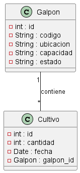

# Prueba ☺
Este es un ejercicio de afianzamiento para el parcial de la materia de análisis de sistemas, de la facultad de ingeniería de sistemas de Corhuila.

# Tema el cual se le debe aplicar MR, Normalización.
## Ejemplo 
#### Necesidad: Se tiene una granja de cultivo de pollos y se requiere desarrollar un sistema que permita controlar el tiempo de cada galpón. Para ello, se debe registrar para cada galpón el `código`, el `número de ubicación` y la `capacidad de pollos`que puede albergar. Además, se debe tener en cuenta el estado de ocupación del galpón, el cual puede estar `marcado como "usado" o "vacío".`Cuando lleguen nuevos pollos, se deberá ingresar la `cantidad`, la `fecha`y actualizar el `estado`del galpón según corresponda.

# Análisis y definición del ejercicio

1. RF:
2. RF:
3. RF:
4. RF:


## Diseñar base de datos.

#### Podemos decir que del enunciado podemos realizar la siguiente tabla.
Datos para tener en cuenta:

| Código  | Ubicación | Capacidad | Cantidad | Fecha     | Estado |
|---------|-----------|-----------|----------|-----------|--------|
|  102    |  C-106    |   5000    |    0     |           | false  |
|  103    |  C-107    |   2600    |   2000   | 21-04-2024| true   |
|  104    |  D-109    |   7000    |   7000   | 21-04-2024| true   |
|  105    |  D-110    |   6000    |   6000   | 21-04-2024| true   |

* De lo anterior, se puede resaltar lo siguiente, si bien es cierto, se puede ingresar los datos sin normalización, se sabe que es necesario para la optimización y traza de los datos.

En este sentido, se procede a normarlizar de la siguiente manera. 

* La clasificación de los galpones, estos son individuales. 


`Galpón`
| Id  | Código | Ubicación | Capaidad |   Estado    |  
|-----|--------|-----------|----------|-------------|
|  1  |   102  |   C-106   |  5000    |   true      |
|  2  |   103  |   C-107   |  2600    |   false     |
|  3  |   104  |   D-109   |  7000    |   false     |
|  4  |   105  |   D-110   |  6000    |   False     |

* Se conoce que inicio de un cultivo, se requiere de la disponibilidad del galpon. Al Asignar un grupo de pollos al galpon, se debe `ocupar` el galpón.

`Cultivo`
| Identificación  | Cantidad |    Fecha    | GalponId | 
|-----------------|----------|-------------|----------|
|      1          |  6600    |  21-04-2024 |    3     |
|      2          |  5400    |  21-04-2024 |    4     |
|      3          |  2500    |  21-04-2024 |    2     |

>Ver 


> Script de la base de datos
```sql
    DROP DATABASE IF EXISTS cultivo;

    CREATE DATABASE cultivo;

    USE cultivo;

    CREATE table galpon(
        id INT NOT NULL PRIMARY KEY AUTO_INCREMENT,
        codigo VARCHAR(50) NOT NULL UNIQUE,
        ubicacion VARCHAR(50) NOT NULL,
        capacidad INT NOT NULL,
        estado BIT DEFAULT TRUE
    ); 

    CREATE table cultivo(
        id INT NOT NULL PRIMARY KEY AUTO_INCREMENT,
        cantidad VARCHAR(50) NOT NULL,
        fecha DATE NOT NULL,
        galpon_id INT NOT NULL,
        FOREIGN KEY (galpon_id) REFERENCES galpon(id)
    ); 
```
# Ver planificación 
[Ver Aquí](https://trello.com/b/21BfO6vM/proyecto)

